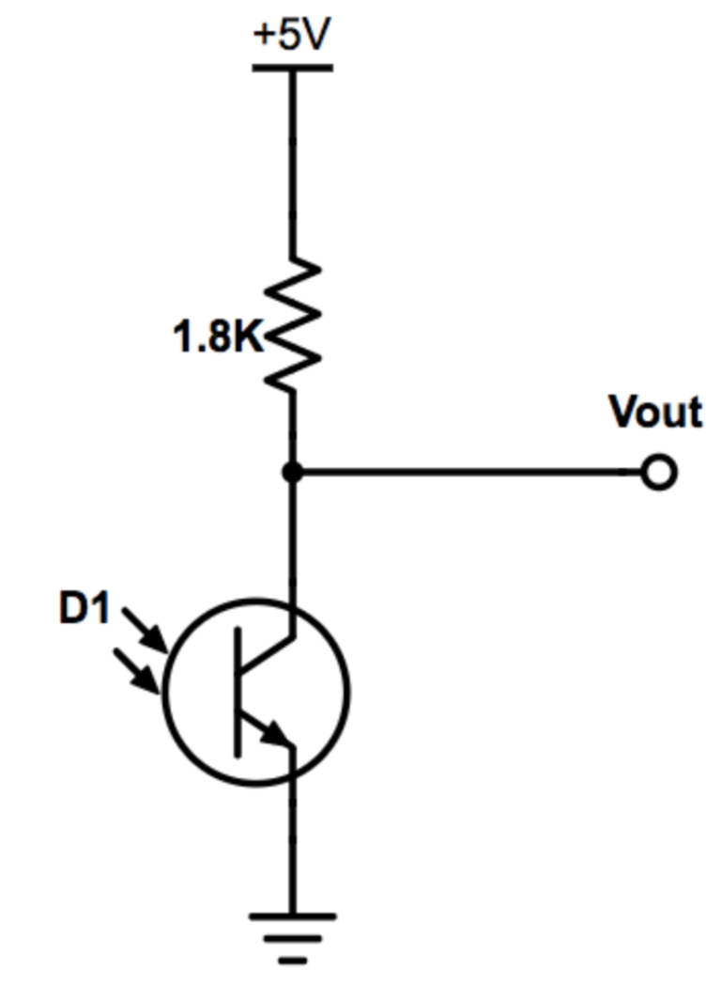
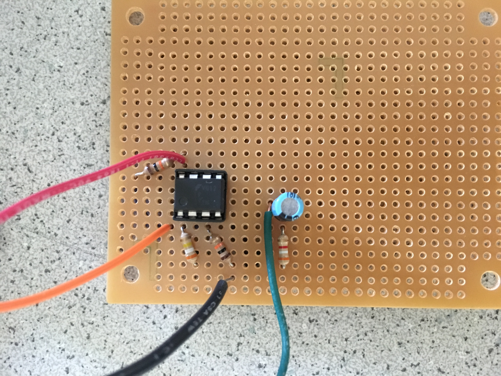
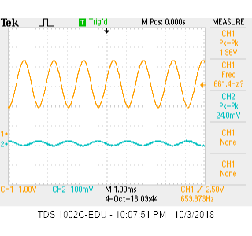
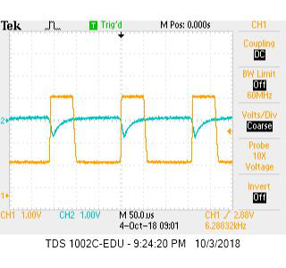
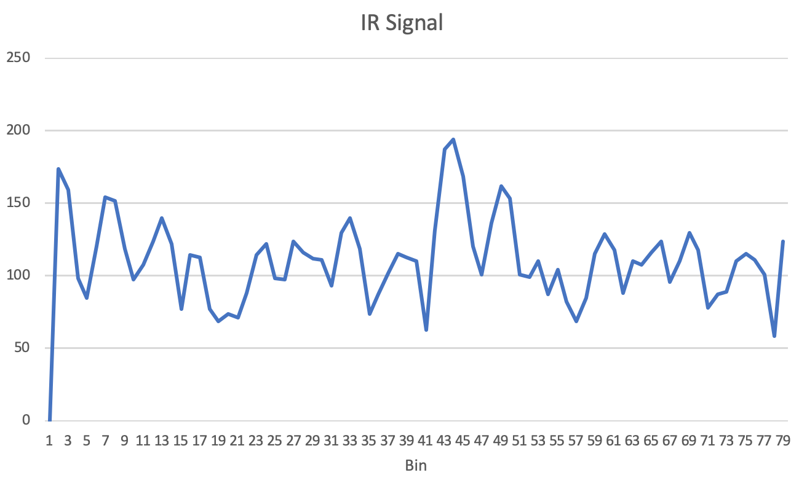
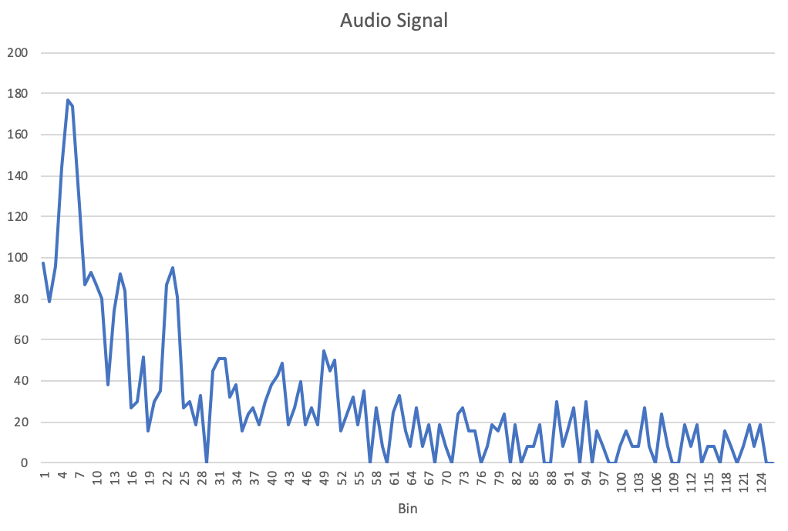

# Lab 2 Report

## Introduction
In this lab we added sensors and signal processing to our robot. We first added a microphone to detect 660 Hz audio signals. Then, we added an IR sensor to detect other robots emitting IR at 6.08kHz. We processed the signals using the Arduino FFT Library. Also, we made 2 amplifiers to detect the signals from a farther distance. Finally, using a digital filter, we were able to ignore the decoys that emit IR at 18kHz.

## Implementation
We used the FFT library for frequency analysis. We see that the FFT library uses a 32 bit pre-scalar and the Arduino runs on 16MHz, thus based on the math we get a bin width of 148.4Hz. We had two target frequencies 660Hz(Audio) and 6.08KHz(IR) which correspond to the 5th and the 43rd bin. In the code we checked the bin values to be above a threshold limit to differentiate the two frequencies.

Amplifier Schematic:
Pretty quickly, we realized that the we would only be able to recognize both the audio and IR signal from very close distances (less than 3 inches). Since during the competition we would need to identify both sound and IR coming from a farther away than our current abilities, we made two amplifiers to amplify both the audio and IR signals. We used the same amplifier as Team Alpha. Here is the schematic of the amplifier with the microphone:

The same amplifier was used for the phototransistor except with the phototransistor set up. We used the same circuit as team alpha shown below:

Here is a picture of our assembled amplifier where red is Vcc, black is ground, orange is the amplified signal, and green is in the input signal:

Before we used either amplifier with the audio or IR signals, we tested both of them and measured the gain. Inputting a small signal on a signal generator, we were able to have a gain of about 55 for the two amplifiers. Here is an oscilloscope screenshot showing the gain where Channel 2 is the input and Channel 1 is the output of the amplifier:

Once we unit tested the amplifiers, we used it to amplify both the audio and IR signals. For example, here are pictures of our signal from the microphone before and after amplification and the phototransistor before and after amplififcation where Channel 2 is the raw signal and Channel 1 is after amplification:

Then we used the Arduino to detect the signals. These graphs confirm that the signals are in the expected bins. From the FFT, in these two graphs, you can clearly see the peaks where the the audio signal in the 5th bin, the IR signal in the 43rd bin:

Our Logic: Since we wanted to analyze signals from two sources, we had to switch which pin out we were reading data from on the arduino each time we ran the FFT. We read audio from A0 and IR from A1. We made this switch in the while loop while running the FFT, switching ADMUX back and forth from 0x40 to 0x41 (switching from A0 to A1). To determine if we are receiving an audio or IR signal, we checked which pin we were reading from, then the corresponding bin for that signal, and if the value was above the threshold, then we were receiving a signal. Similarly, if the value was below the the threshold then we can conclude we were not receiving a signal. We used pinouts 12 and 13 to turn on LEDs to indicate whether we were receiving signals or not.

(Our Code)[ECE3400-Team15/Lab2/IR_and_Audio_code/IR_and_Audio_code.ino]

## Testing
We first tested the audio and IR signals individually. To test the both the audio and IR signals individually, we checked the expected bin of the signal. If the bin magnitude was above a certain amplitude, we turned an LED on, indicating that we were receiving a signal. Similarly, if we did not see the bin value at a high enough value, we turned the LED off. Here is a video of testing the audio sensors:

To test that we could distinguish between a robot and the decoy, we set up an LED to indicate if the we were receiving a 6.08 kHz IR signal. If we were receiving a 18 kHz IR signal, we do nothing. Both the robot hat and the decoy were powered on a moving toward and away from the robot and our system successfully never turned on the LED due to the decoy, but only due to the robot hat.

To test the combined system, we added a second LED, one to indicate we were receiving audio and one to indicate we were receiving IR. Here is the video of testing the single system.

