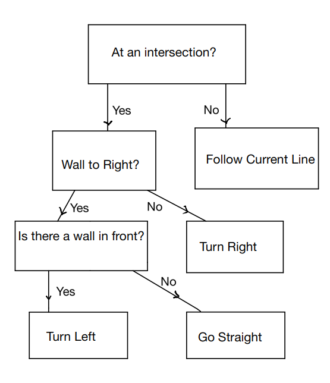
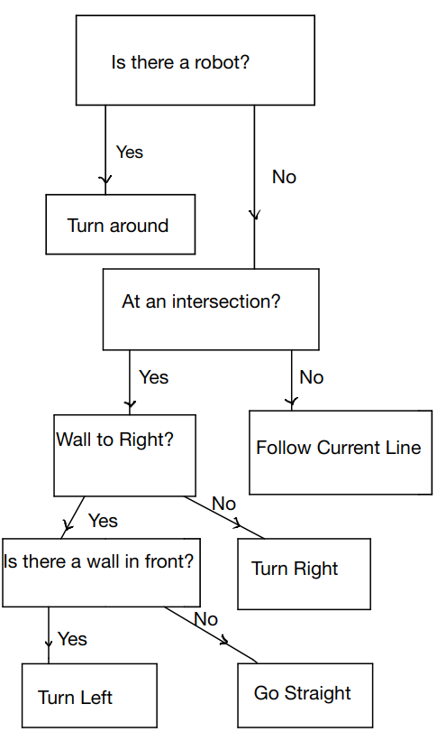

# Introduction  
The purpose of milestone 2 was to implement a wall following algorithm, expand our line following algorithm, as well as integrate everything from labs 1 and 2.  
  
## Expanding on Line Follow  
Our previous implementation of line follow didn’t really change, but we had to properly implement a function for turning left and right in place. This resulted in the functions:  
* *turn_left_linetracker()*  
* *turn_right_linetracker()*  
The functionality can be seen in the specification as well as the code below.  
 

## Wall Following Algorithm  
With line following in place, our wall following algorithm can be seen in the block diagram below.  

  

The maze traversal function *maze_traversal()* now follows simply from the block diagram.  

  

So that we can see what the robot is thinking, we call *check_front()* and *check_right()* at the beginning of maze traversal which turns an LED on if the robot detects a wall.  

Note: due to the about 3 inch distance from the sensors to the wheels, we implemented the function *adjust()* so that we could pivot 90-degrees at an intersection. Adjust simply has the robot go forward up until the wheels reach the intersection. The delay value is found via manual testing.

  

## Avoiding Other Robots  
To avoid other robots we had to implement our IR code and maze traversal code in one document. This was tricky because the fft library and servo library use the same timer. To get around this we declared a global boolean variable **sees_robot** which is initialized to **false**. We then created the function *IR_detection()* which essentially runs the fft code from lab 2 and set sees_robot to true as well as turns an LED on when a robot is detected. To get around the issue of the fft and servo libraries using the same timers we used temporary values to store the relevant registers at the beginning of the function and restored those registers to their previous value at the end. The function implementation can be seen below.  
  

## Integrating Everything  
To integrate everything we had to update our function maze_traversal() to include robot detection. The new block diagram is now  

  

and the maze traversal code following from the block diagram is 

To conclude, our *setup()* code just initializes the servos and indicator LEDS, and our code to run in *loop()* is now just two simple function calls!  
      