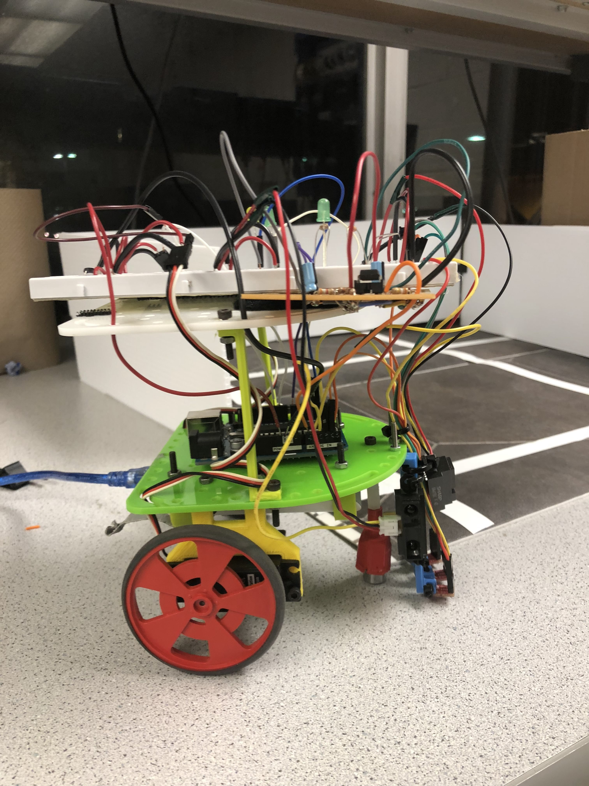
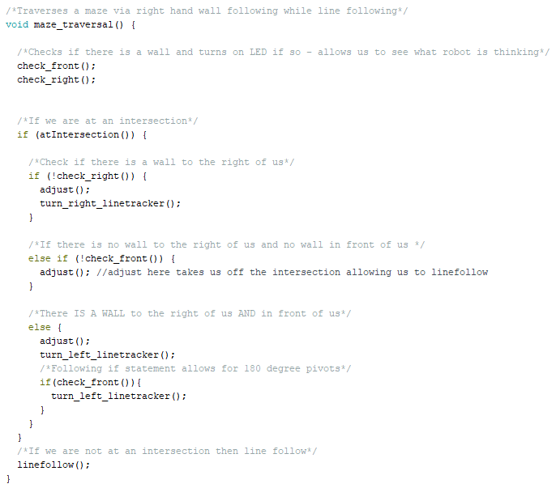
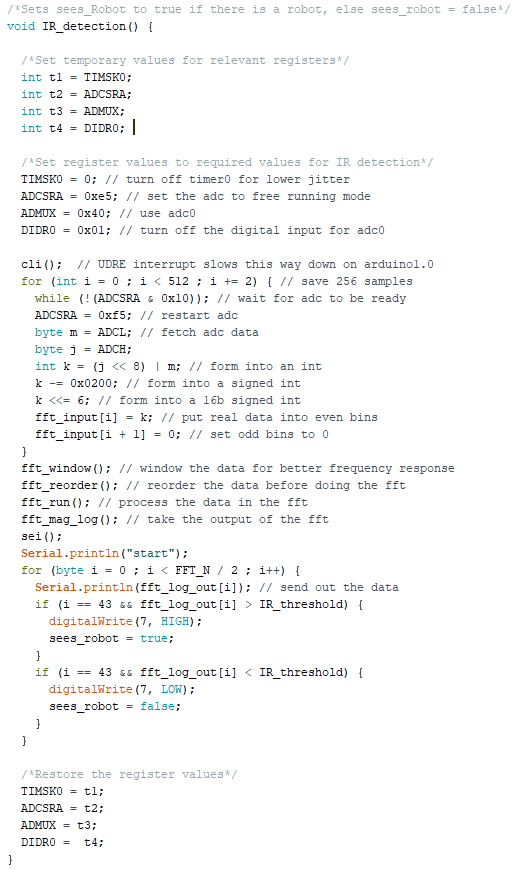

# Introduction  
The purpose of milestone 2 was to implement a wall following algorithm, expand our line following algorithm, as well as integrate everything from labs 1 and 2.  
  
## Updating Our Robot  
We added wall sensors to our robots front and right side. This allowed us to implement a right-hand wall following algorithm. We tested for the threshold to see a wall and have this in the global variable **wall_thresh**. If we detect a wall it means our sensor is reading OVER this threshold.  

We also rearranged our line sensors to all be the same height and in the same line so that we could use just one global threshold variable **line_thresh**. If we detect a while line it means our sensor is reading BELOW this threshold.

We added the IR receiver to the top of the robot on the big breadboard but that is only temporary. We have a global variable for the IR threshold **IR_threshold**. If we detect and IR signal we are reading OVER this threshold

During this milestone our robot got what can only be described as half a makeover. Some wiring was cleaned, and the sensors were all rearranged to be the exact same height. Stay tuned for our upcoming overhaul!  

   

## Implementing Proper Turn Functions
Our previous implementation of line follow didn’t really change, but we had to properly implement a function for turning left and right in place. This resulted in the functions:  
* *turn_left_linetracker()*  
* *turn_right_linetracker()*  
The functionality can be seen in the specification as well as the code below.  
   

where *turn_place_left()* and *turn_place_right()* simply turn the robot in place by having the servos go in opposite directions at the same rate.  
   

## Wall Following Algorithm  
With line following in place, our wall following algorithm can be seen in the block diagram below.  

  

Note: When turning left we turn 180 degrees if there is a wall to the left. THe block diagram repeats itself with each call of *maze_traversal()* in *loop*

The maze traversal function *maze_traversal()* now follows simply from the block diagram.  

  

So that we can see what the robot is thinking, we call *check_front()* and *check_right()* at the beginning of maze traversal which turns an LED on if the robot detects a wall.  

Note: due to the about 3 inch distance from the sensors to the wheels, we implemented the function *adjust()* so that we could pivot 90-degrees at an intersection. Adjust simply has the robot go forward up until the wheels reach the intersection. The delay value is found via manual testing.

  

A video of our robot traversing a maze with our right-hand wall following algorithm is shown below.

<iframe width="560" height="315" src="https://www.youtube.com/embed/Jq2T61r8EME" frameborder="0" allow="autoplay; encrypted-media" allowfullscreen></iframe> 

## Avoiding Other Robots  
To avoid other robots we had to implement our IR code and maze traversal code in one document. This was tricky because the fft library and servo library use the same timer. To get around this we declared a global boolean variable **sees_robot** which is initialized to **false**. We then created the function *IR_detection()* which essentially runs the fft code from lab 2 and set sees_robot to true as well as turns an LED on when a robot is detected. To get around the issue of the fft and servo libraries using the same timers we used temporary values to store the relevant registers at the beginning of the function and restored those registers to their previous value at the end. The function implementation can be seen below.  

  

## Integrating Everything  
To integrate everything we had to update our function *maze_traversal()* to include robot detection. The new block diagram is now  

  

and the maze traversal code following from the block diagram is 

Now, our *setup()* code just initializes the servos and indicator LEDS, and our code to run in *loop()* is now just two simple function calls!  
    

A demonstration of our robot traversing the maze as well as detecting and avoiding other robots is shown below.

## Going Forward  
As we move onto other labs we will likely need to implement a more efficient way to traverse the maze by keeping track of squares we have already visited. We will also likely change the way we avoid robots but turning around seems fine for now.

